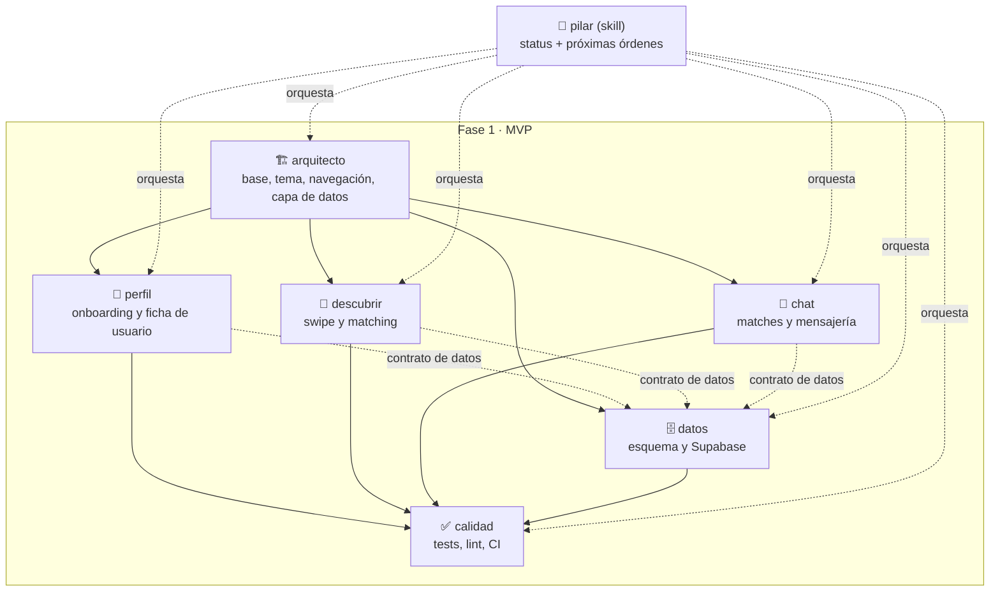

# Mapa de trabajo — LockIn MVP

## Cómo se usa esto

- Antes de escribir código, cualquier sesión debe leer `docs/plan/CONCEPTO.md` (qué estamos construyendo) y este archivo (cómo lo repartimos).
- El trabajo está dividido en 6 bloques. Cada uno tiene un rol definido en `.claude/agents/<rol>.md` y una checklist detallada en `docs/plan/todo/<rol>.md`.
- Para saber por dónde seguir y qué lanzar a continuación, invoca la skill `/pilar` en cualquier sesión de este repo — lee el estado real del código y de los TODO, y genera las órdenes exactas para lanzar el siguiente bloque en otra sesión.
- Regla de oro: **cada bloque toca solo sus propios archivos** (ver "Alcance de archivos" de cada uno más abajo). Si una sesión necesita tocar algo fuera de su bloque, para y dilo en vez de improvisar — así evitamos pisarnos entre sesiones que puedan estar corriendo en paralelo.

## Trabajar con varias herramientas (Claude Code + Codex)

`CONCEPTO.md`, este archivo, `TODO.md` y `todo/*.md` son markdown normal — los puede leer cualquier agente de código, no solo Claude Code. Lo único específico de Claude Code es `.claude/agents/*.md` (subagentes con enrutado automático) y `.claude/skills/pilar/` (el comando `/pilar`).

### Criterio de reparto de tareas

El reparto no se basa en cuál de las dos escribe mejor código — eso no lo sabemos y no hace falta saberlo. Se basa en la diferencia de herramienta, que sí es observable:

- **Claude Code** tiene subagentes con rol fijo (`.claude/agents/*.md`) y la skill `/pilar`, que reconstruye el estado de todo el repo antes de decidir qué hacer. Encaja con tareas que cruzan más de un bloque, decisiones de producto con criterio subjetivo (qué hacer con un color de marca que no pasa contraste, por ejemplo), y cualquier cosa que necesite leerse el roadmap entero para no romper el contrato de otro bloque.
- **Codex no tiene subagentes ni `/pilar`**: cada sesión es un agente plano que solo sabe lo que le pongas en el prompt. Encaja con tareas ya acotadas del todo — alcance de archivos cerrado y criterio de "terminado" objetivo y verificable: tests en verde, un archivo borrado, un cliente implementado contra una interfaz ya congelada. No necesita orquestación, sino una instrucción completa y sin ambigüedad.

Por eso una tarea abierta en `todo/<bloque>.md` puede llevar etiqueta de herramienta:

- **`[Codex]`** — acotada a un archivo o carpeta, criterio de terminado objetivo.
- **`[Claude]`** — cruza bloques, o es una decisión con criterio subjetivo, o necesita releer el roadmap.
- **Sin etiqueta** — bloqueada (faltan credenciales, o herramientas que no existen en el sandbox) o todavía sin decidir.

Etiquetar es opcional: sirve cuando de verdad vas a repartir. `/pilar` lee estas etiquetas y, si hay tareas abiertas de las dos clases, genera una orden por herramienta en el mismo turno — formato de subagente para Claude Code, instrucción explícita autocontenida para Codex (ver `.claude/skills/pilar/SKILL.md`).

### Reglas de siempre

1. Mantén la misma división de bloques y el mismo "alcance de archivos" de cada uno (más abajo) — es lo que evita que dos herramientas se pisen.
2. Codex no tiene `/pilar` ni subagentes automáticos: dale la instrucción a mano, completa y sin ambigüedad — nunca "actúa como el agente X, definido en `.claude/agents/X.md`", porque Codex no tiene ese concepto y no hay enrutado automático que lo resuelva por él.
3. Si vas a correr las dos herramientas **a la vez** en la misma máquina, dales cada una su propio `git worktree` (`git worktree add ../lockin-codex-<tarea> -b codex/<tarea>`) — dos herramientas no pueden tener la misma carpeta en dos ramas distintas a la vez, y así ninguna pisa archivos sin commitear de la otra. Si las usas una detrás de otra, basta con cambiar de rama en la misma carpeta.
4. `TODO.md` y `todo/*.md` son el tablero de estado compartido: sea cual sea la herramienta que complete algo, debe marcarlo ahí y quitar la etiqueta de herramienta de la casilla — así se puede reconstruir el estado real venga el trabajo de donde venga.
5. Al terminar, borra el worktree y la rama. Un worktree olvidado acumula trabajo sin commitear que nadie mira, y en Windows `git worktree remove` puede fallar con `Filename too long` por su `node_modules` — entonces hay que borrar el directorio con el prefijo `\\?\` y luego `git worktree prune`.

## Mapa mental

## Los bloques

### 1. `arquitecto` — Base y arquitectura *(bloqueante, va primero)*

Entrega: proyecto Expo funcionando, sistema de diseño (tokens con la paleta de marca), shell de navegación (tabs + rutas de onboarding), y una capa de datos abstracta (interfaz de repositorio + implementación mock) lista para sustituirse por Supabase sin tocar pantallas.

- Archivos: `src/constants/`, `src/app/_layout.tsx`, `src/app/index.tsx`, `src/components/app-tabs.tsx`, `src/data/**` (nuevo).
- Bloquea a: `perfil`, `descubrir`, `chat`, `datos`.

### 2. `perfil` — Onboarding y ficha de usuario

Entrega: selección de modo, formulario de creación de perfil, pantalla de perfil propio, perfiles mock de ejemplo (incluidos los "sembrados" que dan match recíproco).

- Archivos: `src/app/(onboarding)/`, `src/app/(tabs)/profile.tsx`, `src/features/profile/`.
- Depende de: `arquitecto`.

### 3. `descubrir` — Swipe y matching

Entrega: deck de tarjetas con gesto de swipe, lógica de match (mock), pantalla de match, filtro por modo.

- Archivos: `src/app/(tabs)/discover.tsx`, `src/features/discover/`.
- Depende de: `arquitecto` (y de los perfiles mock de `perfil` para probar el deck, aunque puede avanzar con datos propios de prueba mientras tanto).

### 4. `chat` — Matches y mensajería

Entrega: lista de matches, chat 1:1 mock, icebreakers sugeridos, y el hueco visible para "agendar sesión Lock-In" (el diferenciador del producto — ver CONCEPTO.md).

- Archivos: `src/app/(tabs)/matches.tsx`, `src/app/chat/[matchId].tsx`, `src/features/chat/`.
- Depende de: `arquitecto`.

### 5. `datos` — Esquema y Supabase

Entrega: diseño del esquema SQL (profiles, matches, messages), integración de auth, sustitución del repositorio mock por Supabase real.

- **Bloqueado en parte**: la integración real necesita que el usuario cree un proyecto Supabase y entregue `EXPO_PUBLIC_SUPABASE_URL` / `EXPO_PUBLIC_SUPABASE_ANON_KEY`. Sin eso, este bloque solo puede avanzar el diseño del esquema.
- Archivos: `supabase/`, `src/data/supabase/`.
- Depende de: `arquitecto` (el contrato de la interfaz de repositorio).

### 6. `calidad` — Tests, lint, CI

Entrega: ESLint/Prettier/TypeScript estricto, tests con Jest + React Native Testing Library, workflow de GitHub Actions, pasada de accesibilidad básica.

- Archivos: `.github/workflows/`, `**/*.test.ts(x)`, configuración de lint/format.
- Depende de: que exista código de los demás bloques — trabaja de forma incremental, no espera a que todo el MVP esté terminado.

### 7. `sesiones` — Sesiones Lock-In (Fase 2)

Entrega: propuesta de sesión desde el chat, Pomodoro compartido de bloques 25+5, presencia "está aquí" y aviso local 5 minutos antes. Diseño en `docs/superpowers/specs/2026-09-13-sesiones-lockin-design.md`; plan en `docs/superpowers/plans/2026-09-13-sesiones-lockin.md`.

- Archivos: `src/features/session/`, `src/app/session/`, y en coordinación con `arquitecto` y `datos` las piezas de sesiones de `src/data/**` y `supabase/migrations/`.
- Cruces de una línea declarados en la spec: `src/app/chat/[matchId].tsx`, `src/app/(tabs)/_layout.tsx`, `src/app/_layout.tsx`; más el mock de `expo-notifications` en `jest.setup.js`.
- Depende de: MVP cerrado (todos los bloques anteriores).

### 8. `valoracion` — Valoración de 1 toque post-sesión (Fase 2)

Entrega: al terminar una sesión a la que entraron las dos personas, cada una la valora de un toque (`floja` · `bien` · `genial`) en las 24 h siguientes. La valoración es **privada de quien la escribe**. Diseño en `docs/superpowers/specs/2026-09-15-valoracion-post-sesion-design.md`; plan en `docs/superpowers/plans/2026-09-15-valoracion-post-sesion.md`.

- Archivos: **los mismos que `sesiones`** — no estrena alcance propio. Todo cae en `src/features/session/`, `src/app/session/`, las piezas de sesiones de `src/data/**`, `supabase/migrations/` y los archivos de esquema y E2E que ya tocó la pieza anterior. Sin cruces nuevos con otros bloques.
- **Nunca se lanza a la vez que `sesiones`**: comparten dueño de archivos, así que la regla de oro se cumple por turnos y no por separación. Si las dos tienen trabajo abierto, van una detrás de otra.
- Depende de: `sesiones` entregado. La casilla abierta de `sesiones` (verificación con dos móviles) **no la bloquea**: no tocan lo mismo.

### 9. `rachas` — Rachas de pareja (Fase 2)

Entrega: cada match ve cuántas sesiones compartidas (las dos personas dentro) lleva seguidas, con menos de 7 días entre una y la siguiente, en la tarjeta "Sesión Lock-In" del chat y como etiqueta en su fila de Matches. Es **de la pareja**, se calcula al leer (no se guarda), no depende de zona horaria y **no lee `session_ratings`**, para no delatar la valoración privada. Diseño en `docs/superpowers/specs/2026-09-15-rachas-design.md`; plan en `docs/superpowers/plans/2026-09-15-rachas.md`; checklist con reparto `[Claude]`/`[Codex]` en `docs/plan/todo/rachas.md`.

- Archivos propios: los de `sesiones` — `src/data/streaks.ts` (nuevo), `src/data/types.ts`, `src/data/repositories.ts`, `src/data/repositories.contract.ts`, `src/data/mock/sessions.ts`, `src/data/supabase/{sessions,database.types}.ts`, `supabase/migrations/20260915000200_match_streaks.sql` (nuevo), `supabase/schema-embedded.test.mjs`, `src/features/session/` (`streak.ts` y `use-match-streaks.ts` nuevos; `use-active-session.ts`, `session-card.tsx`, `index.ts`) y `e2e/` (`session-streak.yaml` nuevo; `verify.mjs`, `run.mjs`, `session.test.mjs`). `src/app/session/[sessionId].tsx` **no se toca**.
- **Pisa a `chat`** (cruces declarados): `src/app/(tabs)/matches.tsx` + `test/app/matches.test.tsx`, y `src/features/chat/match-row.tsx` + su test. `MatchRow` recibe la racha como número y no importa de `@/features/session`.
- **Pisa a `calidad`** (una línea): `useFocusEffect` en `expoRouterMock()` de `test/routes.tsx`.
- **Nunca se lanza a la vez que `sesiones` ni que `valoracion`** (mismo dueño de archivos), ni que una sesión de `chat` que toque la lista de Matches.
- Depende de: `sesiones` y `valoracion` entregados — la migración reutiliza `session_both_attended`, que nace en `20260915000100_session_ratings.sql` (ya aplicada en el proyecto real desde `0430117`). Aplicar la de rachas en `grrzmzktrhksbttpbblg` es del usuario.

### 10. `video` — Vídeo real en la sesión Lock-In (Fase 2)

Entrega: llamada de vídeo 1:1 real (WebRTC nativo, sin proveedor de pago)
dentro de la ventana de la sesión Lock-In, con señalización por Supabase
Realtime Broadcast (sin tabla nueva ni credenciales adicionales). Diseño en
`docs/superpowers/specs/2026-09-16-video-real-sesion-design.md`; plan en
`docs/superpowers/plans/2026-09-16-video-real-sesion.md`; checklist en
`docs/plan/todo/video.md`.

- Archivos propios: `src/data/video-signal.ts` (nuevo),
  `src/data/supabase/video-signal.ts` (nuevo), `src/data/active.ts` (añade
  `videoSignal`), `src/features/session/use-video-call.ts` (nuevo),
  `src/features/session/video-call-view.tsx` (nuevo),
  `src/features/session/index.ts`, `jest.setup.js` (mock del módulo nativo),
  `app.json` (plugin + permisos), `package.json`.
- Cruce de una línea declarado: `src/app/session/[sessionId].tsx` (integra
  el hueco de vídeo sin tocar la lógica de fases/asistencia/valoración que ya
  hay — coordinación con `sesiones`, dueño original de ese archivo).
- **No funciona en Expo Go ni en export web** — necesita build de dev client
  (EAS, ya configurado en el repo). La verificación real entre dos
  dispositivos la cierra el usuario, no un agente.
- **Sin bloqueo de credenciales**: Supabase Realtime ya está configurado y
  STUN público no necesita cuenta — a diferencia de `datos`, este bloque no
  espera nada del usuario para avanzar el código.
- Depende de: `sesiones` entregado (usa su pantalla y su noción de ventana de
  sesión).

### 11. `verificacion` — Verificación de autoría de enlaces (Fase 3)

Entrega: que el enlace de GitHub de un perfil pueda probarse suyo, con un sello
que el cliente **no puede encenderse solo**. Se linka una identidad OAuth de
GitHub a la cuenta de Supabase que ya existe (`linkIdentity()` sobre la sesión
anónima) y el sello lo escribe una función `SECURITY DEFINER` que lee
`auth.identities`, sobre dos columnas que el rol `authenticated` no tiene
permiso de escribir. Diseño en
`docs/superpowers/specs/2026-09-16-verificacion-github-design.md`; plan en
`docs/superpowers/plans/2026-09-16-verificacion-github.md`; checklist en
`docs/plan/todo/verificacion.md`.

**Fase 3 son tres sub-proyectos** («salas grupales, verificación, plantillas de
acuerdo entre cofundadores» en `CONCEPTO.md`) y este es el primero. Los otros
dos no están empezados y no comparten nada con él.

Este bloque **cruza cuatro bloques**, y el alcance se declara entero para que
nadie lo descubra a mitad:

| Archivo | Dueño original | Qué se toca |
|---|---|---|
| `src/data/types.ts` | `arquitecto` | `GithubVerification` + un campo en `Profile` |
| `src/data/repositories.ts`, `repositories.contract.ts` | `arquitecto` | tres métodos y sus casos |
| `src/data/supabase/client.ts` | `datos` | una línea: `flowType: 'pkce'` |
| `src/data/mock/`, `src/data/supabase/` | `arquitecto`/`datos` | implementación |
| `supabase/migrations/`, `seed.sql`, `drift-check.mjs`, `schema-embedded.test.mjs` | `datos`/`calidad` | migración y cotejo |
| `src/features/profile/` | `perfil` | el panel de acción y el sello en la ficha |
| `src/features/discover/` | `descubrir` | el sello en la tarjeta |

- **Nunca se lanza a la vez que `perfil`, `descubrir` ni `datos`**: pisa archivos
  suyos, así que va por turnos, no en paralelo.
- **El sello es señal, no puerta**: no filtra el deck, no lo ordena y no
  condiciona el match. Mismo precedente explícito que la complementariedad.
- **El copy dice GitHub y nada más.** Certifica autoría del enlace: ni «perfil
  verificado», ni «persona verificada», ni un check a secas junto al nombre.
- Cero dependencias nuevas y ninguna build nativa: `expo-web-browser`,
  `expo-linking` y `"scheme": "lockin"` ya estaban.
- Depende de: nada del código — no toca Fase 2. **Del usuario sí**: GitHub OAuth
  App en el dashboard, «Enable Manual Linking», aplicar la migración y probar el
  flujo en un dispositivo. Ver `todo/verificacion.md` → "Pendiente del usuario".

## Orden recomendado de trabajo

1. `arquitecto` primero y solo — es la base de todo lo demás.
2. En paralelo, cada uno en su propia rama: `perfil`, `descubrir`, `chat`, y el diseño de esquema de `datos`.
3. Fusionar cada rama según vaya estando lista — revisa conflictos en `src/data/` si dos bloques tocan la misma interfaz sin coordinarse.
4. `calidad` va incorporando cobertura de lo que se vaya fusionando.
5. Integración real de `datos` con Supabase en cuanto el usuario tenga las credenciales.

## Saneamiento de arquitectura (auditoría del 2026-09-17)

Siete problemas de arquitectura detectados el 2026-09-17 y verificados contra el
código el mismo día. **No son un bloque nuevo**: se reparten entre los bloques que
ya existen, respetando su alcance de archivos. El reparto, las órdenes
autocontenidas (una por pegar en una sesión nueva de Claude Code) y el
criterio de terminado de cada una están en
[`ordenes-arquitectura.md`](ordenes-arquitectura.md). El estado se marca en
`TODO.md` → «Saneamiento de arquitectura» y en el `todo/<bloque>.md` de cada uno.

| # | Hallazgo | Bloque | Orden | Ola |
|---|---|---|---|---|
| 1 | No hay identidad real: la cuenta es irrecuperable | `datos` + `perfil` | D2, P1 | 2, 3 |
| 2 | Canales de vídeo y presencia sin autenticar | `datos` | D1 | 1 |
| 3 | `useQuery` sin caché: parpadeo y dos hooks duplicados | `arquitecto` | A1 | 1 |
| 4 | Dos implementaciones del dominio, contrato opt-in en CI | `calidad` | C1 | 2 |
| 5 | Cambio silencioso de backend si faltan credenciales | `arquitecto` | A1 | 1 |
| 6 | Consultas sin paginar y reloj del dispositivo | `datos` | D3 | 3 |
| 7 | Estado mutable de módulo en los dos backends | `arquitecto` | A2 | 3 |

Las olas van en orden y ningún par de órdenes de la misma ola toca los mismos
archivos: **Ola 1** = `A1` + `D1` · **Ola 2** = `D2` + `C1` · **Ola 3** = `P1` +
`D3` + `A2`, con `D3` **nunca** a la vez que `D2` (se pisan en
`src/data/supabase/index.ts`). Solo la Ola 1 lleva etiqueta de herramienta; las
demás están sin etiquetar porque están **bloqueadas por la ola anterior**, no
porque falte decidirlas — la etiqueta que les toca está anotada en su bloque.

**Las siete van a Claude Code**, decidido con el usuario el 2026-09-17. `D1` y
`C1` cumplen el criterio de `[Codex]` de este mismo archivo — alcance cerrado y
criterio de terminado objetivo — y estuvieron etiquetadas así; se reetiquetaron a
`[Claude]` por decisión del usuario. El criterio de reparto de arriba no cambia y
sigue valiendo para lo que venga después de esta ola.

Dos de estos hallazgos son de seguridad y van primero por eso: el 2 (cualquiera
con un `sessionId` entra en la señalización WebRTC de otros) y el 1 (pérdida
silenciosa de datos de usuario).

## Qué NO hacer

- No adelantar trabajo de Fase 2+ (video real, salas grupales, Modo Talento, premium) — ver "Fuera de alcance" en `CONCEPTO.md`.
- No lanzar dos bloques que tocan los mismos archivos a la vez sin avisar del riesgo de conflicto.
- No dejar que `datos` invente credenciales o las hardcodee si no existen — debe decirlo y limitarse al esquema.
