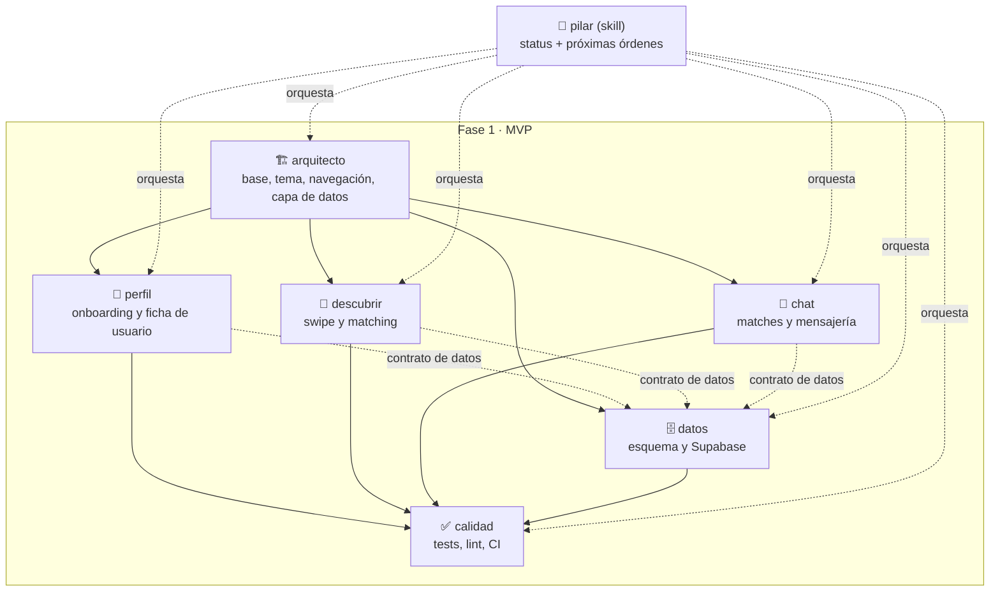

# Mapa de trabajo — LockIn MVP

## Cómo se usa esto

- Antes de escribir código, cualquier sesión debe leer `docs/plan/CONCEPTO.md` (qué estamos construyendo) y este archivo (cómo lo repartimos).
- El trabajo está dividido en 6 bloques. Cada uno tiene un rol definido en `.claude/agents/<rol>.md` y una checklist detallada en `docs/plan/todo/<rol>.md`.
- Para saber por dónde seguir y qué lanzar a continuación, invoca la skill `/pilar` en cualquier sesión de este repo — lee el estado real del código y de los TODO, y genera las órdenes exactas para lanzar el siguiente bloque en otra sesión.
- Regla de oro: **cada bloque toca solo sus propios archivos** (ver "Alcance de archivos" de cada uno más abajo). Si una sesión necesita tocar algo fuera de su bloque, para y dilo en vez de improvisar — así evitamos pisarnos entre sesiones que puedan estar corriendo en paralelo.

## Mapa mental

## Los bloques

### 1. `arquitecto` — Base y arquitectura *(bloqueante, va primero)*

Entrega: proyecto Expo funcionando, sistema de diseño (tokens con la paleta de marca), shell de navegación (tabs + rutas de onboarding), y una capa de datos abstracta (interfaz de repositorio + implementación mock) lista para sustituirse por Supabase sin tocar pantallas.

- Archivos: `src/constants/`, `src/app/_layout.tsx`, `src/app/index.tsx`, `src/components/app-tabs.tsx`, `src/data/**` (nuevo).
- Bloquea a: `perfil`, `descubrir`, `chat`, `datos`.

### 2. `perfil` — Onboarding y ficha de usuario

Entrega: selección de modo, formulario de creación de perfil, pantalla de perfil propio, perfiles mock de ejemplo (incluidos los "sembrados" que dan match recíproco).

- Archivos: `src/app/(onboarding)/`, `src/app/(tabs)/profile.tsx`, `src/features/profile/`.
- Depende de: `arquitecto`.

### 3. `descubrir` — Swipe y matching

Entrega: deck de tarjetas con gesto de swipe, lógica de match (mock), pantalla de match, filtro por modo.

- Archivos: `src/app/(tabs)/discover.tsx`, `src/features/discover/`.
- Depende de: `arquitecto` (y de los perfiles mock de `perfil` para probar el deck, aunque puede avanzar con datos propios de prueba mientras tanto).

### 4. `chat` — Matches y mensajería

Entrega: lista de matches, chat 1:1 mock, icebreakers sugeridos, y el hueco visible para "agendar sesión Lock-In" (el diferenciador del producto — ver CONCEPTO.md).

- Archivos: `src/app/(tabs)/matches.tsx`, `src/app/chat/[matchId].tsx`, `src/features/chat/`.
- Depende de: `arquitecto`.

### 5. `datos` — Esquema y Supabase

Entrega: diseño del esquema SQL (profiles, matches, messages), integración de auth, sustitución del repositorio mock por Supabase real.

- **Bloqueado en parte**: la integración real necesita que el usuario cree un proyecto Supabase y entregue `EXPO_PUBLIC_SUPABASE_URL` / `EXPO_PUBLIC_SUPABASE_ANON_KEY`. Sin eso, este bloque solo puede avanzar el diseño del esquema.
- Archivos: `supabase/`, `src/data/supabase/`.
- Depende de: `arquitecto` (el contrato de la interfaz de repositorio).

### 6. `calidad` — Tests, lint, CI

Entrega: ESLint/Prettier/TypeScript estricto, tests con Jest + React Native Testing Library, workflow de GitHub Actions, pasada de accesibilidad básica.

- Archivos: `.github/workflows/`, `**/*.test.ts(x)`, configuración de lint/format.
- Depende de: que exista código de los demás bloques — trabaja de forma incremental, no espera a que todo el MVP esté terminado.

## Orden recomendado de trabajo

1. `arquitecto` primero y solo — es la base de todo lo demás.
2. En paralelo, cada uno en su propia rama: `perfil`, `descubrir`, `chat`, y el diseño de esquema de `datos`.
3. Fusionar cada rama según vaya estando lista — revisa conflictos en `src/data/` si dos bloques tocan la misma interfaz sin coordinarse.
4. `calidad` va incorporando cobertura de lo que se vaya fusionando.
5. Integración real de `datos` con Supabase en cuanto el usuario tenga las credenciales.

## Qué NO hacer

- No adelantar trabajo de Fase 2+ (video real, salas grupales, Modo Talento, premium) — ver "Fuera de alcance" en `CONCEPTO.md`.
- No lanzar dos bloques que tocan los mismos archivos a la vez sin avisar del riesgo de conflicto.
- No dejar que `datos` invente credenciales o las hardcodee si no existen — debe decirlo y limitarse al esquema.
