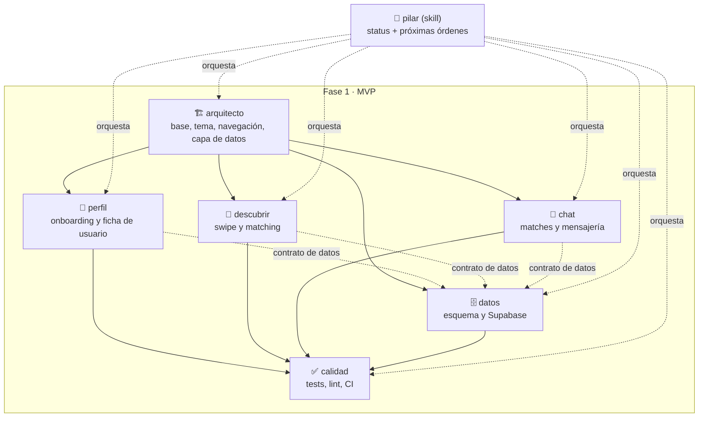

# Mapa de trabajo — LockIn MVP

## Cómo se usa esto

- Antes de escribir código, cualquier sesión debe leer `docs/plan/CONCEPTO.md` (qué estamos construyendo) y este archivo (cómo lo repartimos).
- El trabajo está dividido en 6 bloques. Cada uno tiene un rol definido en `.claude/agents/<rol>.md` y una checklist detallada en `docs/plan/todo/<rol>.md`.
- Para saber por dónde seguir y qué lanzar a continuación, invoca la skill `/pilar` en cualquier sesión de este repo — lee el estado real del código y de los TODO, y genera las órdenes exactas para lanzar el siguiente bloque en otra sesión.
- Regla de oro: **cada bloque toca solo sus propios archivos** (ver "Alcance de archivos" de cada uno más abajo). Si una sesión necesita tocar algo fuera de su bloque, para y dilo en vez de improvisar — así evitamos pisarnos entre sesiones que puedan estar corriendo en paralelo.

## Trabajar con varias herramientas (Claude Code + Codex)

`CONCEPTO.md`, este archivo, `TODO.md` y `todo/*.md` son markdown normal — los puede leer cualquier agente de código, no solo Claude Code. Lo único específico de Claude Code es `.claude/agents/*.md` (subagentes con enrutado automático) y `.claude/skills/pilar/` (el comando `/pilar`).

### Criterio de reparto de tareas

El reparto no se basa en cuál de las dos escribe mejor código — eso no lo sabemos y no hace falta saberlo. Se basa en la diferencia de herramienta, que sí es observable:

- **Claude Code** tiene subagentes con rol fijo (`.claude/agents/*.md`) y la skill `/pilar`, que reconstruye el estado de todo el repo antes de decidir qué hacer. Encaja con tareas que cruzan más de un bloque, decisiones de producto con criterio subjetivo (qué hacer con un color de marca que no pasa contraste, por ejemplo), y cualquier cosa que necesite leerse el roadmap entero para no romper el contrato de otro bloque.
- **Codex no tiene subagentes ni `/pilar`**: cada sesión es un agente plano que solo sabe lo que le pongas en el prompt. Encaja con tareas ya acotadas del todo — alcance de archivos cerrado y criterio de "terminado" objetivo y verificable: tests en verde, un archivo borrado, un cliente implementado contra una interfaz ya congelada. No necesita orquestación, sino una instrucción completa y sin ambigüedad.

Por eso una tarea abierta en `todo/<bloque>.md` puede llevar etiqueta de herramienta:

- **`[Codex]`** — acotada a un archivo o carpeta, criterio de terminado objetivo.
- **`[Claude]`** — cruza bloques, o es una decisión con criterio subjetivo, o necesita releer el roadmap.
- **Sin etiqueta** — bloqueada (faltan credenciales, o herramientas que no existen en el sandbox) o todavía sin decidir.

Etiquetar es opcional: sirve cuando de verdad vas a repartir. `/pilar` lee estas etiquetas y, si hay tareas abiertas de las dos clases, genera una orden por herramienta en el mismo turno — formato de subagente para Claude Code, instrucción explícita autocontenida para Codex (ver `.claude/skills/pilar/SKILL.md`).

### Reglas de siempre

1. Mantén la misma división de bloques y el mismo "alcance de archivos" de cada uno (más abajo) — es lo que evita que dos herramientas se pisen.
2. Codex no tiene `/pilar` ni subagentes automáticos: dale la instrucción a mano, completa y sin ambigüedad — nunca "actúa como el agente X, definido en `.claude/agents/X.md`", porque Codex no tiene ese concepto y no hay enrutado automático que lo resuelva por él.
3. Si vas a correr las dos herramientas **a la vez** en la misma máquina, dales cada una su propio `git worktree` (`git worktree add ../lockin-codex-<tarea> -b codex/<tarea>`) — dos herramientas no pueden tener la misma carpeta en dos ramas distintas a la vez, y así ninguna pisa archivos sin commitear de la otra. Si las usas una detrás de otra, basta con cambiar de rama en la misma carpeta.
4. `TODO.md` y `todo/*.md` son el tablero de estado compartido: sea cual sea la herramienta que complete algo, debe marcarlo ahí y quitar la etiqueta de herramienta de la casilla — así se puede reconstruir el estado real venga el trabajo de donde venga.
5. Al terminar, borra el worktree y la rama. Un worktree olvidado acumula trabajo sin commitear que nadie mira, y en Windows `git worktree remove` puede fallar con `Filename too long` por su `node_modules` — entonces hay que borrar el directorio con el prefijo `\\?\` y luego `git worktree prune`.

## Mapa mental

## Los bloques

### 1. `arquitecto` — Base y arquitectura *(bloqueante, va primero)*

Entrega: proyecto Expo funcionando, sistema de diseño (tokens con la paleta de marca), shell de navegación (tabs + rutas de onboarding), y una capa de datos abstracta (interfaz de repositorio + implementación mock) lista para sustituirse por Supabase sin tocar pantallas.

- Archivos: `src/constants/`, `src/app/_layout.tsx`, `src/app/index.tsx`, `src/components/app-tabs.tsx`, `src/data/**` (nuevo).
- Bloquea a: `perfil`, `descubrir`, `chat`, `datos`.

### 2. `perfil` — Onboarding y ficha de usuario

Entrega: selección de modo, formulario de creación de perfil, pantalla de perfil propio, perfiles mock de ejemplo (incluidos los "sembrados" que dan match recíproco).

- Archivos: `src/app/(onboarding)/`, `src/app/(tabs)/profile.tsx`, `src/features/profile/`.
- Depende de: `arquitecto`.

### 3. `descubrir` — Swipe y matching

Entrega: deck de tarjetas con gesto de swipe, lógica de match (mock), pantalla de match, filtro por modo.

- Archivos: `src/app/(tabs)/discover.tsx`, `src/features/discover/`.
- Depende de: `arquitecto` (y de los perfiles mock de `perfil` para probar el deck, aunque puede avanzar con datos propios de prueba mientras tanto).

### 4. `chat` — Matches y mensajería

Entrega: lista de matches, chat 1:1 mock, icebreakers sugeridos, y el hueco visible para "agendar sesión Lock-In" (el diferenciador del producto — ver CONCEPTO.md).

- Archivos: `src/app/(tabs)/matches.tsx`, `src/app/chat/[matchId].tsx`, `src/features/chat/`.
- Depende de: `arquitecto`.

### 5. `datos` — Esquema y Supabase

Entrega: diseño del esquema SQL (profiles, matches, messages), integración de auth, sustitución del repositorio mock por Supabase real.

- **Bloqueado en parte**: la integración real necesita que el usuario cree un proyecto Supabase y entregue `EXPO_PUBLIC_SUPABASE_URL` / `EXPO_PUBLIC_SUPABASE_ANON_KEY`. Sin eso, este bloque solo puede avanzar el diseño del esquema.
- Archivos: `supabase/`, `src/data/supabase/`.
- Depende de: `arquitecto` (el contrato de la interfaz de repositorio).

### 6. `calidad` — Tests, lint, CI

Entrega: ESLint/Prettier/TypeScript estricto, tests con Jest + React Native Testing Library, workflow de GitHub Actions, pasada de accesibilidad básica.

- Archivos: `.github/workflows/`, `**/*.test.ts(x)`, configuración de lint/format.
- Depende de: que exista código de los demás bloques — trabaja de forma incremental, no espera a que todo el MVP esté terminado.

## Orden recomendado de trabajo

1. `arquitecto` primero y solo — es la base de todo lo demás.
2. En paralelo, cada uno en su propia rama: `perfil`, `descubrir`, `chat`, y el diseño de esquema de `datos`.
3. Fusionar cada rama según vaya estando lista — revisa conflictos en `src/data/` si dos bloques tocan la misma interfaz sin coordinarse.
4. `calidad` va incorporando cobertura de lo que se vaya fusionando.
5. Integración real de `datos` con Supabase en cuanto el usuario tenga las credenciales.

## Qué NO hacer

- No adelantar trabajo de Fase 2+ (video real, salas grupales, Modo Talento, premium) — ver "Fuera de alcance" en `CONCEPTO.md`.
- No lanzar dos bloques que tocan los mismos archivos a la vez sin avisar del riesgo de conflicto.
- No dejar que `datos` invente credenciales o las hardcodee si no existen — debe decirlo y limitarse al esquema.
